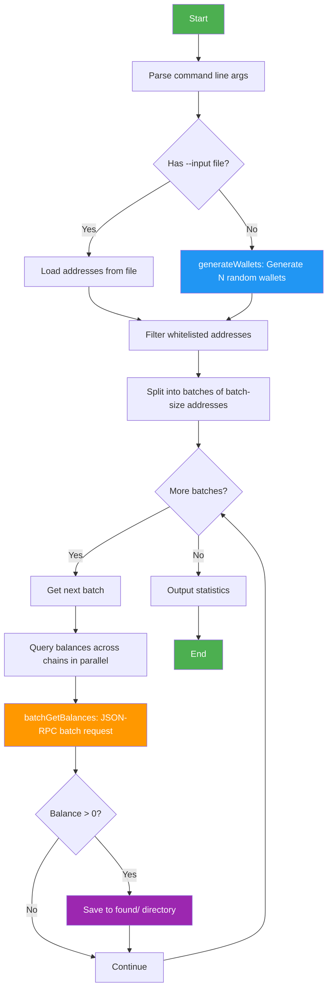

[English](README.md) | [中文](README.zh-CN.md)

# EVM Multi-Chain Wallet Balance Scanner

Generate wallet addresses and check balances across 40+ EVM-compatible chains.

## Scan Flow



### Key Steps

| Step | Description |
|------|-------------|
| `generateWallets()` | Generate random private keys and addresses using ethers.js `Wallet.createRandom()` |
| `batchGetBalances()` | Pack multiple addresses into a single JSON-RPC batch request to query all balances on one chain |
| Parallel query | Query multiple chains simultaneously (default: 10 chains in parallel) |
| Batch processing | Each batch: 50 addresses × 9 chains = 450 RPC calls packed into 9 batch requests |

## Project Structure

```
eth-scanner/
├── chains.js           # Chain config (RPC, chainId, token symbols)
├── config.env          # Config file (whitelist + network filter)
├── config-loader.js    # Config loader
├── found-wallet.js     # Auto-save wallets with balance
├── found/              # Found wallets directory (auto-created, gitignored)
├── scanner.js          # Per-wallet scanner (detailed output, shows each chain)
├── batch-scanner.js    # Batch scanner (JSON-RPC batch, high speed)
├── run.sh              # Continuous scanning script with logging
├── package.json
└── README.md
```

## Quick Start

```bash
pnpm install

# Scan 10 random wallets (default)
node scanner.js

# Scan 100 random wallets, only check ETH/BSC/Polygon
node scanner.js random -n 100 -c eth,bsc,polygon

# Scan hex range 0x1 to 0xFFFF private keys
node scanner.js range --start 0x1 --end 0xFFFF

# Load addresses from file
node scanner.js file -i addresses.txt

# Batch mode (high speed, best for 100+ addresses)
node batch-scanner.js -n 1000
node batch-scanner.js -n 500 -c eth,bsc,arbitrum,base -o results.json
```

## Scanner Comparison

| Feature | scanner.js | batch-scanner.js |
|---------|-----------|-----------------|
| Speed | ~0.1 wallets/s | ~60+ wallets/s |
| Output | Detailed per-chain display | Only shows wallets with balance |
| Use case | Small batches, debugging | Large batch scanning |
| Method | Individual eth_getBalance | JSON-RPC batch |

## Continuous Scanning

Use `run.sh` for continuous loop scanning with automatic logging.

```bash
# Infinite loop scanning (Ctrl+C to stop)
./run.sh

# 5000 wallets per round, 10 rounds
./run.sh 5000 10

# Run in background
nohup ./run.sh > /dev/null 2>&1 &
```

### Script Parameters

```bash
./run.sh [wallets_per_round] [total_rounds]
```

- First parameter: Wallets per round (default: 10000)
- Second parameter: Total rounds, 0 or omitted for infinite loop

### Logs & Results

```
logs/
├── scan.log      # All rounds log (appended, \r filtered)
└── results.json  # Latest round results (overwritten)
```

```bash
# Real-time log
tail -f logs/scan.log

# Only show found wallets
grep "FOUND" logs/scan.log
```

### Progress Display

The scanner shows the current round number in progress output:

```
[R1] [1/200] Scanning batch of 50 addresses...
[R1] [20/200] Scanning batch of 50 addresses...
[R1] SCAN COMPLETE
  Wallets scanned: 10000
  Found with balance: 0
```

### Default Configuration

`run.sh` has these optimized defaults:

| Parameter | Value | Description |
|-----------|-------|-------------|
| CHAINS | eth,bsc,polygon,arbitrum,base,optimism,avalanche | 7 mainstream chains |
| BATCH_SIZE | 50 | Addresses per batch |
| CONCURRENCY | 10 | Parallel chains |
| TIMEOUT | 10000 | RPC timeout (ms) |

Edit the variables at the top of `run.sh` to customize.

## Supported Chains (40+)

Ethereum, Arbitrum, Optimism, Base, Linea, zkSync Era, Scroll, Blast, Mantle,
Mode, Zora, opBNB, Polygon, BNB Chain, Avalanche, Fantom, Cronos, Gnosis,
Celo, Moonbeam, Moonriver, Aurora, Harmony, Klaytn, Meter, Syscoin, Telos,
WEMIX, EthereumPoW, SmartBCH, Polygon zkEVM, Sei, Taiko, Manta Pacific,
Gravity, WorldChain, Abstract, Soneium, Ink, Unichain, Corn + testnets

## Parameters

```
-n, --count N        Number of random wallets (default: 10)
-c, --chains LIST    Comma-separated chain filter (e.g. eth,bsc,polygon)
--start HEX          Range mode start hex
--end HEX            Range mode end hex
-i, --input FILE     Load addresses from file (one per line, or CSV)
-o, --output FILE    Save results as JSON
--concurrency N      Parallel RPC count (default: 5)
--timeout MS         Per-chain RPC timeout (default: 8000ms)
--testnets           Include testnets
--batch-size N       Batch mode addresses per batch (default: 20)
--round N            Current round number (for display in logs)
```

## Config File config.env

All configuration in one file, edit `config.env`:

```
# Network filter — leave empty to scan all, fill in to scan only specified networks
CHAINS=eth,bsc,polygon

# Whitelist — matching addresses are skipped
WHITELIST=0x1234...abcd,0x5678...ef01
```

### Network Filter

The `CHAINS` field supports partial matching and aliases:

| Config | Actual Match |
|--------|--------------|
| `eth` | Ethereum, EthereumPoW |
| `bsc` | BNB Chain |
| `polygon` | Polygon, Polygon zkEVM |
| `arb` or `arbitrum` | Arbitrum One |
| `avax` | Avalanche |
| `matic` | Polygon |
| `ftm` | Fantom |
| `ethereum` | Ethereum mainnet only |

Leave `CHAINS=` empty to scan all 40+ networks.

Command line `--chains` parameter has higher priority than config.env.

### Whitelist

The `WHITELIST` field configures addresses to skip, comma-separated, case-insensitive.

Both scanners support:
- `scanner.js` — Shows "SKIPPED (whitelisted)" and skips
- `batch-scanner.js` — Auto-filters, no RPC requests made

## Auto-Save Found Wallets

Wallets with balance are automatically saved to `found/` directory:

- `found/found-wallets.md` — Markdown format with private keys, addresses, chain balances
- `found/found-wallets.jsonl` — JSON Lines format for programmatic reading

Each discovery is appended, never overwriting history.

Saved info includes: private key, address, mnemonic (if any), network name, token symbol, Chain ID, balance.

## Notes

- Probability of finding a wallet with balance via random keys is near zero (2^256 possibilities)
- Some RPCs may return errors due to rate limiting, scripts have auto-retry
- For large scans, use batch-scanner.js — the speed difference is massive
- Add more chain RPC addresses in chains.js as needed
- Only wallets with balance > 0 are saved; zero-balance wallets are skipped silently

## ☕ Support the Project

If you find this project useful, consider buying me a coffee!

**EVM address (all EVM chains):** `0x1162d48d78a1b15e16e299797ccc981f10ea6470`
