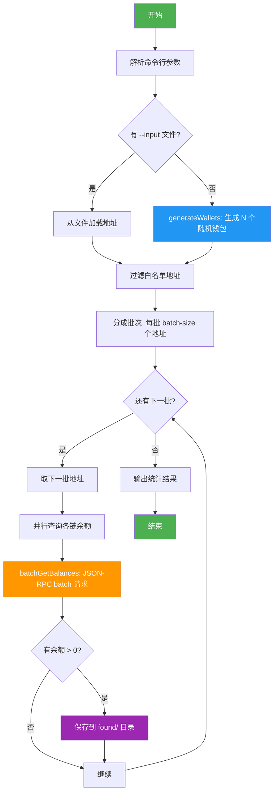

[English](README.md) | [中文](README.zh-CN.md)

# EVM 多链钱包余额扫描器

生成钱包地址，遍历 40+ 条 EVM 兼容链检查余额。

## 扫描流程



### 关键步骤说明

| 步骤 | 说明 |
|------|------|
| `generateWallets()` | 用 ethers.js 的 `Wallet.createRandom()` 生成随机私钥和地址 |
| `batchGetBalances()` | 将多个地址打包成一个 JSON-RPC batch 请求，一次查询一条链上所有地址的余额 |
| 并行查询 | 同时对多条链发起请求（默认 10 条链并发） |
| 分批处理 | 每批 50 个地址 × 9 条链 = 450 个 RPC 调用打包成 9 个 batch 请求 |

## 项目结构

```
eth-scanner/
├── chains.js           # 链配置（RPC、chainId、代币符号）
├── config.env          # 配置文件（白名单 + 网络筛选）
├── config-loader.js    # 配置加载器
├── found-wallet.js     # 发现余额自动保存
├── found/              # 发现的钱包存放目录（自动创建，已 gitignore）
├── scanner.js          # 逐钱包扫描（详细输出，显示每条链结果）
├── batch-scanner.js    # 批量扫描（JSON-RPC batch，高速）
├── package.json
└── README.md
```

## 快速开始

```bash
npm install

# 扫描 10 个随机钱包（默认）
node scanner.js

# 扫描 100 个随机钱包，只查 ETH/BSC/Polygon
node scanner.js random -n 100 -c eth,bsc,polygon

# 扫描 hex range 0x1 到 0xFFFF 的私钥
node scanner.js range --start 0x1 --end 0xFFFF

# 从文件读取地址
node scanner.js file -i addresses.txt

# 批量模式（高速，适合 100+ 地址）
node batch-scanner.js -n 1000
node batch-scanner.js -n 500 -c eth,bsc,arbitrum,base -o results.json
```

## 两种扫描器对比

| 特性 | scanner.js | batch-scanner.js |
|------|-----------|-----------------|
| 速度 | ~0.1 wallets/s | ~60+ wallets/s |
| 输出 | 每条链详细显示 | 只显示有余额的 |
| 适用 | 小批量、调试 | 大批量扫描 |
| 原理 | 逐个 eth_getBalance | JSON-RPC batch |

## 持续运行

使用 `run.sh` 可以持续循环扫描，自动保存日志和结果。

```bash
# 无限循环扫描（Ctrl+C 停止）
./run.sh

# 每轮 5000 个钱包，跑 10 轮
./run.sh 5000 10

# 后台运行
nohup ./run.sh > /dev/null 2>&1 &
```

### 脚本参数

```bash
./run.sh [每轮数量] [总轮次]
```

- 第一个参数：每轮扫描钱包数量（默认 10000）
- 第二个参数：总轮次，0 或省略表示无限循环

### 日志与结果

```
logs/
├── scan.log      # 所有轮次运行日志（追加写入）
└── results.json  # 最新一轮扫描结果（覆盖）
```

```bash
# 实时查看日志
tail -f logs/scan.log

# 只看发现有钱包的记录
grep "发现" logs/scan.log
```

### 默认配置

run.sh 内置以下优化参数：

| 参数 | 值 | 说明 |
|------|-----|------|
| CHAINS | eth,bsc,polygon,arbitrum,base,optimism,avalanche | 7 条主流链 |
| BATCH_SIZE | 50 | 每批地址数 |
| CONCURRENCY | 10 | 并行链数 |
| TIMEOUT | 10000 | RPC 超时 (ms) |

如需修改，直接编辑 `run.sh` 头部变量即可。

## 支持的链（40+）

Ethereum, Arbitrum, Optimism, Base, Linea, zkSync Era, Scroll, Blast, Mantle,
Mode, Zora, opBNB, Polygon, BNB Chain, Avalanche, Fantom, Cronos, Gnosis,
Celo, Moonbeam, Moonriver, Aurora, Harmony, Klaytn, Meter, Syscoin, Telos,
WEMIX, EthereumPoW, SmartBCH, Polygon zkEVM, Sei, Taiko, Manta Pacific,
Gravity, WorldChain, Abstract, Soneium, Ink, Unichain, Corn + testnets

## 参数说明

```
-n, --count N        随机生成钱包数量（默认 10）
-c, --chains LIST    逗号分隔的链名筛选（e.g. eth,bsc,polygon）
--start HEX          range 模式起始 hex
--end HEX            range 模式结束 hex
-i, --input FILE     从文件读取地址（每行一个，或 CSV）
-o, --output FILE    结果保存为 JSON
--concurrency N      并行 RPC 数（默认 5）
--timeout MS         单链 RPC 超时（默认 8000ms）
--testnets           包含测试网
--batch-size N       批量模式每批地址数（默认 20）
```

## 配置文件 config.env

所有配置集中在一个文件中，编辑 `config.env`：

```
# 网络筛选 — 留空扫描全部，填入则只扫描指定网络
CHAINS=eth,bsc,polygon

# 白名单 — 匹配的地址跳过扫描
WHITELIST=0x1234...abcd,0x5678...ef01
```

### 网络筛选

`CHAINS` 字段支持部分匹配和别名：

| 配置 | 实际匹配 |
|------|----------|
| `eth` | Ethereum, EthereumPoW |
| `bsc` | BNB Chain |
| `polygon` | Polygon, Polygon zkEVM |
| `arb` 或 `arbitrum` | Arbitrum One |
| `avax` | Avalanche |
| `matic` | Polygon |
| `ftm` | Fantom |
| `ethereum` | 仅 Ethereum 主网 |

留空 `CHAINS=` 则扫描全部 40+ 网络。

命令行 `--chains` 参数优先级高于 config.env，会覆盖配置文件设置。

### 白名单

`WHITELIST` 字段配置需要跳过的地址，多个地址用逗号分隔，不区分大小写。

两个扫描器均支持：
- `scanner.js` — 显示 "SKIPPED (whitelisted)" 并跳过
- `batch-scanner.js` — 自动过滤，不发起 RPC 请求

## 发现余额自动保存

扫描过程中发现有钱包余额的地址，会自动保存到 `found/` 目录：

- `found/found-wallets.md` — Markdown 格式，包含私钥、地址、各链余额详情
- `found/found-wallets.jsonl` — JSON Lines 格式，方便程序读取

每次发现新余额会自动追加，不会覆盖历史记录。

保存的信息包括：私钥、地址、助记词（如有）、网络名、币名、Chain ID、余额。

## 注意事项

- 随机私钥找到有余额地址的概率接近于零（2^256 种可能）
- 部分 RPC 可能因限流返回错误，脚本有自动重试
- 大量扫描建议用 batch-scanner.js，速度差距巨大
- 可自行在 chains.js 中添加更多链的 RPC 地址
